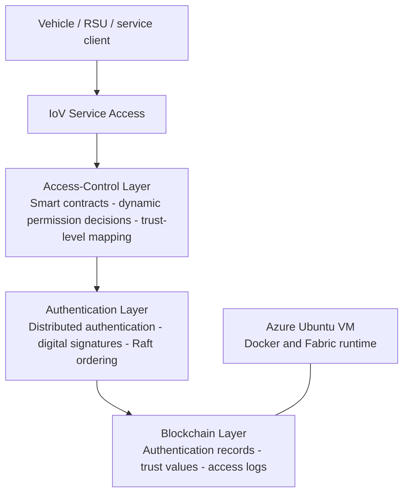

# Trust-Aware IoV Access Control Prototype

**Selected public evidence from a 2025-2026 Internet of Things coursework project.**

This project explored whether a permissioned blockchain could support distributed vehicle authentication and trust-aware access control without relying on a single central authorization service.

> Public scope: this directory is a curated evidence archive, not a full release of the original coursework submission or all implementation assets.

## Core problem

Internet-of-Vehicles systems exchange sensitive vehicle, road, and service data across vehicles, roadside units, edge services, and traffic-management organizations. Static or centralized authorization can create single points of failure and cannot easily adapt permissions when node behaviour changes.

The prototype combined:

- Hyperledger Fabric consortium-chain authentication;
- digital-certificate verification and auditable on-chain records;
- ABAC-style permission decisions;
- trust-score updates mapped to access levels;
- smart-contract-enforced grant, denial, or revocation decisions;
- Azure Ubuntu VM deployment evidence;
- workload evaluation covering throughput, latency, CPU use, and simulated malicious-node scenarios.

## Architecture

## Prototype flow

1. A vehicle or service identity is registered and associated with a digital certificate.
2. A request is checked against identity, attributes, current trust level, and policy conditions.
3. Chaincode returns an allow, deny, or revocation decision.
4. Authentication and access events are recorded for auditability.
5. Behaviour outcomes update the node trust value, which can change later permissions.

## Evidence retained in this archive

- a reviewed summary of the original English coursework report;
- a separation between the IoV access-control prototype and the later Fabric/Kubernetes infrastructure work;
- a record of the Cisco Packet Tracer networking exercises that supported the networking component;
- a privacy-conscious description of Azure VM and SSH deployment evidence.

See:

- [`docs/course-report-summary.md`](docs/course-report-summary.md)
- [`docs/networking-foundation.md`](docs/networking-foundation.md)
- [Fabric/Kubernetes follow-on evidence](https://github.com/haveanicedaymydear/FabricK8s)

## Evidence and privacy policy

The original report, raw screenshots, interactive Cisco Packet Tracer files, complete chaincode, and some configuration assets are retained privately. They are not all redistributed because they may contain coursework material, infrastructure identifiers, third-party content, or implementation details that were not prepared for public release.

## Limitations

This was a coursework-scale prototype rather than a production vehicle-security system. The public archive does not claim independent reproduction of every performance or attack-simulation number contained in the original report. The strongest verified contribution is the end-to-end system design and prototype workflow: certificate-based identity, permissioned-ledger records, trust updates, policy enforcement, and deployment evidence.

## Status

Original project period: **December 2025 - January 2026**  
Public evidence archive consolidated: **July 2026**
